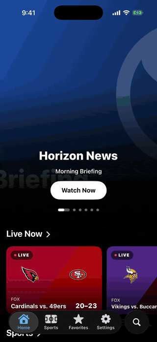
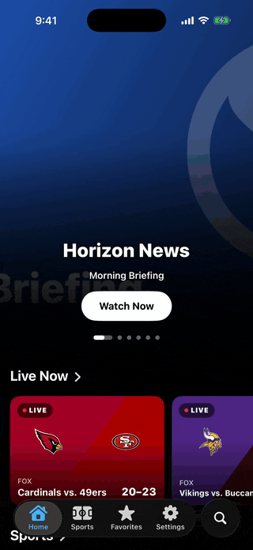
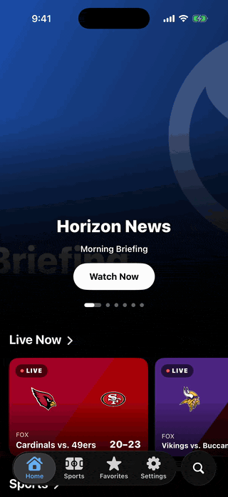

# Onside TV

A clean IPTV app for iPhone with a sports score center built in. It used to be called Nebulo, same app with a new name.

Check the scores, tap a game, and it finds the channel that's showing it on your own IPTV service.

Heads up: Onside TV doesn't come with any channels. You need your own subscription from an IPTV provider.

<p align="center">
  
  
  
  
</p>

<p align="center"><sub>Demo channels are open-licence test streams (Blender open movies), not a real provider.</sub></p>

## Installation

1. Download the latest IPA from the [Releases page](https://github.com/mongoosemonke504/OnsideTV/releases)
2. Sideload it onto your iPhone
3. Log in with your provider info and enjoy!

Releases from before the name change are still called Nebulo.

## Features

### Sports
- Live scores, schedules and standings for the NFL, college football, NBA, WNBA, college basketball, MLB, NHL, soccer from all over, F1, golf, tennis, MMA and more
- Favorite your teams, leagues, drivers and golfers so their next game or live score shows up on the home screen
- Team, league and driver pages with schedules, results, standings, rosters and stats
- Game cards with lineups, team stats, momentum, shot maps and box scores
- Live Activities so you can follow the score from your Lock Screen and Dynamic Island
- Reminders before a game starts

### Finding the game
When you tap a game, the app looks through your channels for it. It matches both team names against your TV guide around the start time. If it's sure it found the right channel it just starts playing, and if not it shows you the best matches to pick from.

### Watching
- TV guide with what's on now and next, plus the full schedule for each channel
- Multi-view to watch up to 4 streams at once
- Picture in Picture and AirPlay, and the audio keeps playing when you leave the app
- Record shows from the guide or set your own time
- Catch-up if your provider supports it
- Swipe up for a quick channel switcher, or swipe left and right to change channels
- Subtitles, closed captions, audio tracks and aspect ratio options

### Playlists
- Xtream Codes logins and M3U playlists, and you can use more than one at a time
- Add extra XMLTV guide links
- Search channels, shows and teams
- Rename, hide and reorder channels

### Look and feel
Made for iOS 26 with Liquid Glass all through the app.

## Requirements
- An iPhone on iOS 26 or newer
- An IPTV subscription (Xtream Codes or M3U)

## Privacy
No accounts, no ads, no analytics and no tracking. Your login stays on your phone and only gets sent to your provider.

## Recording the demos
The GIFs above come from scripted UI tests, so they can be re-recorded after any UI change:

```sh
brew install ffmpeg      # once
./record-demos.sh        # or: ./record-demos.sh home watch
```

The tests launch the app with `-demoMode` (debug builds only), which loads a generated playlist of open-licence test streams with a made-up guide. The walkthroughs live in `OnsideTVUITests/OnsideTVDemoTests.swift`.

## ❤️ Support the project

Onside TV is free and open-source. If you enjoy using it, consider buying me a coffee!

<a href="https://buymeacoffee.com/mongoosemonke">
  
</a>

Come hang out in the [Discord](https://discord.gg/msq2tcd5Rg) too.

## License

The code is under the [MIT License](LICENSE). That doesn't cover the Onside TV name or the app icon, so if you publish your own version, please give it a different name and icon.

Video playback uses [VLCKit](https://code.videolan.org/videolan/VLCKit), which has its own license ([LGPL-2.1](https://www.gnu.org/licenses/old-licenses/lgpl-2.1.html)).

---

*Found a bug? [Open an issue!](https://github.com/mongoosemonke504/OnsideTV/issues)*
